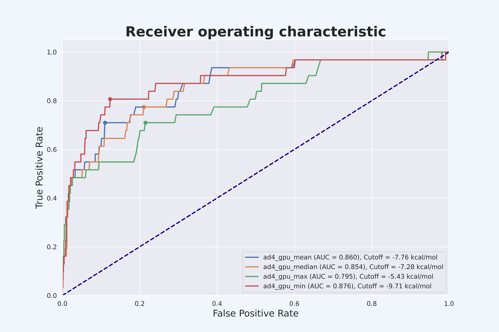
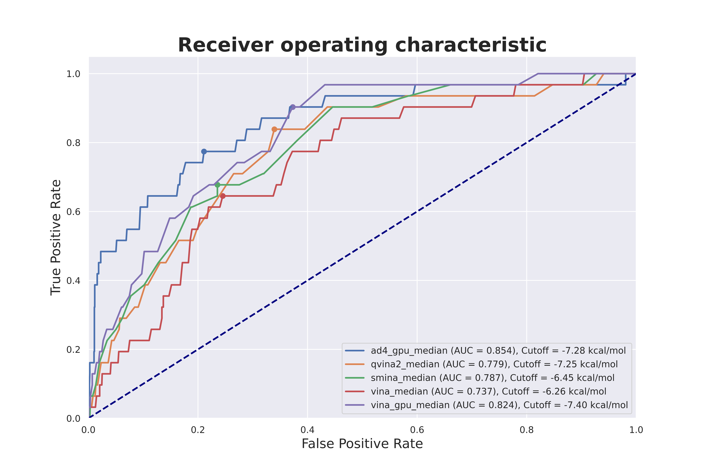

# DockValid
This package contains:
- Automated docking scores extraction
- Retrospective control validation
- Re-docking (updating...)

# Overview

## **1. Docking software integrated with code:**
- Autodock vina 1.2.3
- Smina
- Qvina2
- Vina GPU
- Autodock GPU

## **2. Docking result analysis**


## **3. Retrospective control**



## **4. Software comparison&&


# Requirements

This module requires the following modules:

- [RDkit](https://www.rdkit.org/)
- [scikit-learn](https://scikit-learn.org/stable/)

# Installation
Clone this repository to use

# Folder   
The folder structure should look like this:

    DockValid (project root)
    |__  README.md
    |__  DockValid (source code)
    |__  Test.ipynb
    |__  Data
    |__  |__ data... (downloaded from onedrive)
    |    |__ results..
    |  
    |    
    |......
## Usage

```python

import os
import glob
import pandas as pd
import numpy as np
import sys
sys.path.append('DockValid')
from crawl_score import crawl_score
from validation_process import validation_process
from internal_valid import internal_valid
from validation_compare import validation_compare
import warnings
warnings.filterwarnings('ignore')

## 1. Crawl score

path =os.getcwd()+'/Data/'
auto_crawl = crawl_score(path = path,num_conform = 1000, soft = ['vina', 'smina', 'qvina2', 'vina_gpu','ad4_gpu'])

# 2. Validation process
path = "./Data/Result"
df = pd.read_csv(path+'/vina_gpu.csv').drop(['0'], axis =1) # load data
dock = validation_process(data = df, active_col = 'Active', score_type= "vina_gpu_mean", rescore_method = 'minmax', figsize =(12,8), verbose = True) 
dock.validation()

# 3. Internal camparison
path = "./Data/Result"
df = pd.read_csv(path+'/vina_gpu.csv').drop(['0'], axis =1) # load data
inter = internal_valid(df, active_col='Active',name ='vina_gpu', rescore_method='minmax', figsize = (12,8), savefig=True, verbose = None)
inter.fit()     

# 4. External comparison
path = "./Data/Result"
ext = validation_compare(path = path, active_col = "Active", rescore_method = 'minmax', savefig =True, figsize = (12,8), verbose = None, clean = True)
ext.fit()

ext.internal_fit() ## automated internal comparison

```
